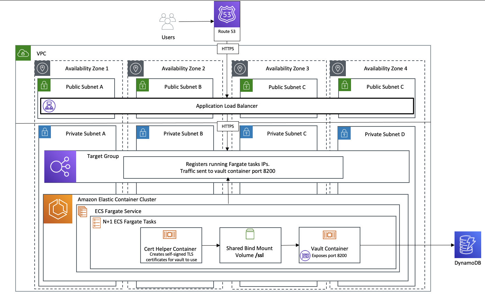

# About

This project will contain everything needed to run an HA vault cluster backed by DynamoDB and exposed on an Application Load Balancer. 
The ALB will listen over HTTPS on port 443 and HTTP on port 80 which redirects to the HTTPS listener. By default, the security group on the ALB will have no ingress rules and they must be added after deployment to connect.

# Architecture Diagram



# High Level Deployment Steps
- Create the certhelper container and store in ECR or similar.
- Create and validate an AC certificate.
- Deploy CloudFormation
- Map ALB DNS to FQDN in Route53 or other DNS provider.
- Add ingress rules on ALB security group.
- Initialize Vault

# Cert Helper
For this deployment to work, you must create a container that will generate self-signed certificates. Ideally, this container will reside in ECR.

The cert helper is a container that will generate self-signed certificates specific to the running host each time a new vault task is created. The certhelper container and the vault container share a bind mount at /ssl which is where our deployment will look for the generated certificates. The vault container will not start until the cert helper container is in the COMPLETED status, indicating the certificates are created and available.

To build this container, edit [createcert.sh](./certhelper-container/createcert.sh) and replace `DNS.1 = vault.timsavage.upmce.net` with `DNS.1 = YOUR-DNS-NAME`. Then perform standard docker build. Example ECR build and push below. Note the ECR repo `certhelper` already exists.

```bash
aws --profile $PROFILENAME ecr get-login-password --region #REGION | docker login --username AWS --password-stdin $AWS_ACCOUNT_ID.dkr.ecr.$REGION.amazonaws.com

cd certhelper-container

docker build . -t $AWS_ACCOUNT_ID.dkr.ecr.$REGION.amazonaws.com/certhelper:latest

docker push $AWS_ACCOUNT_ID.dkr.ecr.$REGION.amazonaws.com/certhelper:latest
```

# Create an ACM certificate for the ALB

Make a new ACM certificate. This certificate must be validated before deploying the CloudFormation.

# Deploy Vault

Run the cloudformation [here](./cloudformation/vault.json)

# Map DNS

Map the created ALB DNS to your desired fully qualified domain name.

# Initialize Vault

Scale your ECS service to at least one running task. Add your IP address to allowed inbound rules on the created ALB on port 443.

Once the targets are in-service on the load balancer, initialize Vault by running the following API call:

```bash
curl --request PUT -d '{"recovery_shares": 1, "recovery_threshold": 1}' https://YOUR-DNS-NAME/v1/sys/init
```

This will output something like:
```
{"keys":[],"keys_base64":[],"recovery_keys":["xxxxxxxxxxxxxxxxxxx"],"recovery_keys_base64":["xxxxxxxxxxxxxxxxxx"],"root_token":"xxxxxxxxxxxxxxxxxxxxx"}
```

Make sure you save this information in Secrets manager or similar. These keys can not be retrieved later. The root token is what you will use to initially log in an configure Vault.

# Use Vault

You can now use Vault

# Considerations
- Retention period and KMS encryption could be added to the created ECS task's log group's cloudformation resource.
- WAF can be attached to ALB.
- Service Discovery can be added to ECS service (would require rebuild of the service if already deployed)
- Running more than one vault task can cause long load times since vault will continually redirect to the ALB until it lands on the single primary Vault instance. More inormation can be found in [Hashicorp's documentation](https://www.vaultproject.io/docs/concepts/ha) under the load balancer section.
